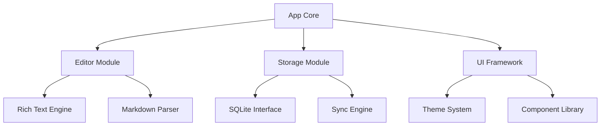

# AI-Human Collaborative Notepad Project

このプロジェクトでは生成AIを最大限に活用してメモ帳アプリを開発します。アプリのコンセプトや要件定義、技術選定は生成AIと人間が協力して行います。コードはすべて生成AIが作成し、人間が動作を確認します。コードやドキュメントはGitリポジトリで管理し、生成AIが都度リポジトリの情報を参照しながら開発を進めます。

比較的複雑な実装になることが予想されるため、開発に関する情報はすべてドキュメント化し、生成AIが参照できるようにします。

また、人間が生成AIへ行った指示の内容は`history/YYYY/MM`ディレクトリ以下に連番で記録するものとします。

## 概要

- [コンセプト](docs/concept.md)
- [技術選定](docs/technology.md)
- [ロードマップ](docs/roadmap.md)
- [アーキテクチャ](docs/architecture.md)

---

## AI-Human Collaboration Framework

### Project Structure Metadata

```metadata
PROJECT_TYPE: TypeScript-based cross-platform application
ARCHITECTURE_PATTERN: Component-based architecture
PRIMARY_LANGUAGE: TypeScript
SECONDARY_LANGUAGES: HTML, CSS, SQL
DEVELOPMENT_PARADIGM: AI-Human collaborative development
REPOSITORY_STRUCTURE:
  - /docs: Project documentation
  - /src: Source code
  - /history: Record of AI-Human interactions
  - /tests: Test suites
  - /assets: Static assets
```

### Development Workflow

```workflow
1. HUMAN: Define task or feature requirements
2. AI: Analyze requirements and existing codebase
3. AI: Propose implementation approach
4. HUMAN: Review and approve approach
5. AI: Implement code
6. HUMAN: Test and provide feedback
7. AI: Refine implementation based on feedback
8. HUMAN: Approve final implementation
9. BOTH: Document the process in /history
```

### Code Context Annotations

To enhance AI understanding of the codebase, we use special comment annotations:

```typescript
// @AI-CONTEXT: Brief description of this file's purpose and role in the system
// @AI-DEPENDENCIES: List of modules/components this file depends on
// @AI-CONSUMERS: List of modules/components that depend on this file
// @AI-LIFECYCLE: Information about initialization, state management, cleanup
// @AI-EDGE-CASES: Known edge cases or special handling requirements
// @AI-FUTURE-WORK: Planned enhancements or known limitations
```

### Component Relationship Graph



### Development Conventions

#### Naming Conventions

- **Files**: `kebab-case.ts` for general files, `PascalCase.tsx` for React components
- **Classes/Interfaces**: `PascalCase`
- **Functions/Methods**: `camelCase`
- **Constants**: `UPPER_SNAKE_CASE`
- **Private properties**: `_camelCase`

#### Directory Structure

- Feature-based organization (`/src/features/editor`, `/src/features/storage`)
- Shared utilities in `/src/utils`
- Common components in `/src/components`
- Types and interfaces in `/src/types`

#### State Management

- Zustand for global state
- React hooks for component state
- Clear delineation between UI state and application state

### AI-Optimized Documentation Format

Documentation should follow this structure for optimal AI parsing:

```
## ComponentName

### Purpose
[Concise description of the component's purpose]

### Dependencies
- DependencyA: [Purpose of dependency]
- DependencyB: [Purpose of dependency]

### API
- methodName(param1: Type, param2: Type): ReturnType
  - param1: [Description]
  - param2: [Description]
  - returns: [Description]

### State
- stateName: Type - [Purpose and lifecycle]

### Events
- eventName: [When it's triggered and what it does]

### Edge Cases
- [List of edge cases and how they're handled]

### Example Usage
```typescript
// Code example
```

### AI Decision Trees

For complex logic, we document decision trees to help AI understand the reasoning:

```
DECISION: [Brief description of decision point]
OPTIONS:
  - Option A:
    - PROS: [List of advantages]
    - CONS: [List of disadvantages]
  - Option B:
    - PROS: [List of advantages]
    - CONS: [List of disadvantages]
CHOICE: [Selected option]
RATIONALE: [Explanation of why this option was chosen]
```

### Implementation Patterns

#### Component Implementation Pattern

```typescript
// @AI-CONTEXT: [Component description]

// Imports
import { ... } from '...';

// Types
interface ComponentProps {
  // Props with comments
}

// Helper functions
function helperFunction() {
  // Implementation
}

// Component
export function Component(props: ComponentProps) {
  // State hooks
  
  // Effect hooks
  
  // Event handlers
  
  // Render helpers
  
  // Main render
  return (
    // JSX
  );
}

// Export
export default Component;
```

#### Module Implementation Pattern

```typescript
// @AI-CONTEXT: [Module description]

// Imports
import { ... } from '...';

// Types
export interface ModuleTypes {
  // Type definitions with comments
}

// Constants
const MODULE_CONSTANTS = {
  // Named constants
};

// Helper functions
function helperFunction() {
  // Implementation
}

// Main functionality
export function mainFunction() {
  // Implementation
}

// Module API
export const ModuleName = {
  mainFunction,
  // Other exports
};

// Default export
export default ModuleName;
```

### AI-Human Communication Protocol

To streamline communication between AI and human developers:

```
## Task Definition
[Clear description of the task]

## Context
[Relevant background information]

## Requirements
- [Specific requirement 1]
- [Specific requirement 2]

## Constraints
- [Constraint 1]
- [Constraint 2]

## Expected Outcome
[Description of what success looks like]

## Questions
- [Question 1]
- [Question 2]
```

### Semantic Versioning for AI Understanding

```
version: major.minor.patch-aicompat

Where:
- major: Breaking changes
- minor: New features, backward compatible
- patch: Bug fixes, backward compatible
- aicompat: AI compatibility version (increments when documentation format changes)
```

### AI Development Metrics

We track these metrics to optimize the AI-Human collaboration:

1. **Iteration Count**: Number of revisions before acceptance
2. **Context Utilization**: How effectively AI uses provided context
3. **Documentation Adherence**: How well AI follows documentation standards
4. **Code Quality**: Measured by static analysis tools
5. **Implementation Efficiency**: Lines of code vs. functionality delivered

### AI Knowledge Continuity

To maintain context across development sessions:

1. Each major feature has a dedicated knowledge file in `/docs/ai-context/`
2. Session summaries are stored in `/history` with semantic linking
3. Key decisions are documented with reasoning and alternatives considered
4. Code changes include references to the motivating requirements

### Troubleshooting AI-Human Collaboration

Common issues and solutions:

1. **Context Loss**: Reference previous history files and documentation
2. **Misaligned Understanding**: Create explicit examples and counterexamples
3. **Scope Creep**: Clearly define task boundaries in the initial request
4. **Implementation Gaps**: Break complex tasks into smaller, well-defined subtasks
5. **Technical Debt**: Schedule regular refactoring sessions with clear goals

---

## Getting Started

1. Review the [コンセプト](docs/concept.md) document to understand the project vision
2. Examine the [技術選定](docs/technology.md) document for the technical approach
3. Follow the development workflow outlined above
4. Use the AI-optimized documentation formats for new components and modules
5. Record all significant AI-Human interactions in the history directory

## Contributing

This project uses an AI-Human collaborative development model. To contribute effectively:

1. Familiarize yourself with the documentation formats and conventions
2. Follow the established workflow for feature development
3. Maintain comprehensive documentation for AI context
4. Use clear, specific language when communicating with AI
5. Document all significant interactions in the history directory
