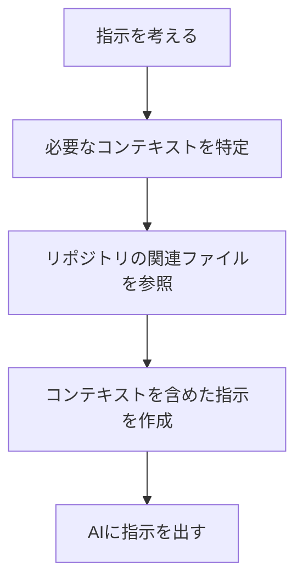
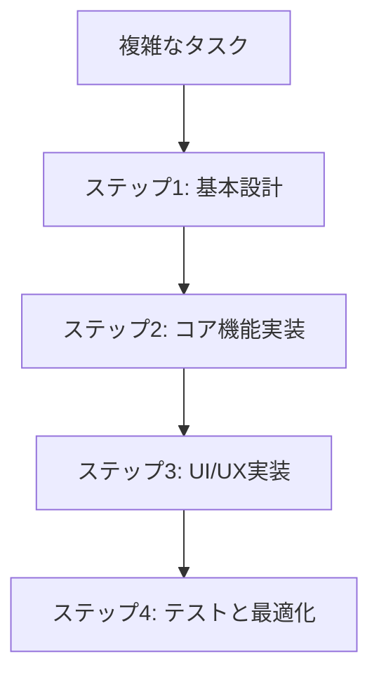
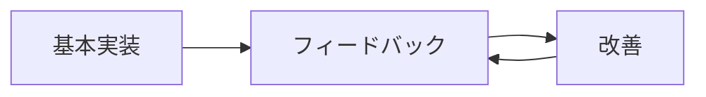

# 生成AIへの指示ガイド

このドキュメントでは、AI-Human Collaborative Notepad Projectにおいて、生成AIに効果的に指示を出すためのガイドラインを提供します。プロジェクトの開発を効率的に進めるために、人間と生成AIがどのように協力すべきかを詳細に説明します。

## 基本原則

### 1. コンテキストの提供

生成AIに指示を出す際は、十分なコンテキストを提供することが重要です。これにより、AIはプロジェクトの現状を理解し、適切な提案や実装を行うことができます。



#### 効果的なコンテキスト提供の例

```
リポジトリの内容を読んで、現在のエディタコンポーネントの実装状況を理解して。TipTapエディタにコードブロックの構文ハイライト機能を追加したいので、必要な実装を行って。
```

### 2. 明確な目標設定

AIに何を達成してほしいのかを明確に伝えることが重要です。目標が曖昧だと、AIは意図しない方向に進む可能性があります。

#### 良い例

```
ノートの検索機能を実装して。以下の要件を満たす必要があります：
1. タイトルと本文の全文検索
2. タグによるフィルタリング
3. 検索結果のハイライト表示
4. 検索履歴の保存
```

#### 避けるべき例

```
検索機能を良くして。
```

### 3. 段階的な指示

複雑なタスクは、小さなステップに分割して指示することで、AIがより効果的に対応できます。



#### 段階的指示の例

```
プラグインシステムの実装を進めたいと思います。まずは以下のステップで進めましょう：

1. まず、プラグインのインターフェース定義とAPIの設計案を作成して
2. 次に、プラグインのローディングとライフサイクル管理の実装を行って
3. その後、サンドボックス環境の構築方法を提案して
4. 最後に、サンプルプラグインの実装例を示して
```

## 指示のパターン

### 1. 探索的指示

プロジェクトの初期段階や新機能の検討時に、AIに複数の選択肢や可能性を探ってもらうための指示パターンです。

```
リポジトリの内容を読んで、データベースビューの実装方法について3つの異なるアプローチを提案して。各アプローチのメリット・デメリットと、私たちのプロジェクトにとってどれが最適かの分析も含めて。
```

### 2. 実装指示

具体的な機能やコンポーネントの実装を依頼する指示パターンです。

```
リポジトリの内容を読んで、Zustandを使用したノート管理のステート設計と実装を行って。ノートの作成、編集、削除、タグ付け、お気に入り登録の機能をサポートする必要があります。
```

### 3. 改善指示

既存のコードやドキュメントの改善を依頼する指示パターンです。

```
src/components/Editor/index.tsxを読んで、パフォーマンスの問題点を特定し、改善案を実装して。特に大きなドキュメントの編集時のレンダリング効率に注目して。
```

### 4. 分析指示

コードベースや設計の分析を依頼する指示パターンです。

```
リポジトリの内容を読んで、現在のアーキテクチャの強みと弱みを分析して。特にスケーラビリティとメンテナンス性の観点から評価して、改善すべき点があれば提案して。
```

### 5. 学習指示

AIに特定の知識や概念を学習させるための指示パターンです。

```
このプロジェクトでは、CRDTベースの同期メカニズムとしてY.jsを使用しています。Y.jsの基本概念、主要なデータ型、同期の仕組み、そして私たちのプロジェクトでの活用方法について理解して。
```

## AI最適化コミュニケーション

### 1. 構造化情報の提供

AIがより効率的に情報を処理できるよう、構造化された形式で情報を提供します。

#### コンポーネント仕様の例

```
## コンポーネント: NoteList

### 目的
ノートのリストを表示し、フィルタリング、ソート、選択機能を提供する

### Props
- notes: Note[] - 表示するノートの配列
- onSelect: (noteId: string) => void - ノート選択時のコールバック
- filter: FilterOptions - フィルタリングオプション
- sortBy: SortOption - ソートオプション

### 状態
- selectedNoteId: string | null - 現在選択されているノートのID
- hoveredNoteId: string | null - 現在ホバーされているノートのID

### 振る舞い
- ノートをクリックすると選択状態になり、onSelectが呼ばれる
- フィルターが変更されると、表示されるノートが更新される
- ソートオプションが変更されると、ノートの表示順が更新される

### エッジケース
- ノートが存在しない場合は「ノートがありません」メッセージを表示
- 選択されたノートがフィルタリングで非表示になった場合、選択状態をクリア
```

### 2. 決定木の提供

複雑な意思決定プロセスをAIに伝えるために、決定木を使用します。

```
DECISION: データストレージ方式の選択
OPTIONS:
  - SQLite:
    - PROS: 強力なクエリ機能、トランザクションサポート、成熟した技術
    - CONS: セットアップの複雑さ、Webでの使用に追加ライブラリが必要
  - IndexedDB:
    - PROS: ブラウザネイティブ、非同期API、オブジェクトストレージ
    - CONS: 限定的なクエリ機能、ブラウザ間の互換性問題
  - LocalStorage:
    - PROS: 単純なAPI、広いブラウザサポート
    - CONS: 容量制限、文字列のみの保存、パフォーマンス問題
CHOICE: SQLite (better-sqlite3 for Electron, sql.js-wasm for Web)
RATIONALE: 強力なクエリ機能とトランザクションサポートが必要なため。Webでの使用にはsql.js-wasmを使用して互換性を確保。
```

### 3. コードアノテーション

AIがコードの目的と文脈を理解しやすいように、特別なコメントアノテーションを使用します。

```typescript
// @AI-CONTEXT: このファイルはノートのデータモデルと操作を定義する中核モジュール
// @AI-DEPENDENCIES: SQLiteDatabase, EventEmitter
// @AI-CONSUMERS: NoteList, NoteEditor, SearchEngine

import { Database } from 'better-sqlite3';
import { EventEmitter } from 'events';

// @AI-LIFECYCLE: アプリケーション起動時に初期化され、終了時に破棄される
export class NoteManager extends EventEmitter {
  private db: Database;
  
  constructor(dbPath: string) {
    super();
    this.db = new Database(dbPath);
    this.initializeDatabase();
  }
  
  // @AI-EDGE-CASES: データベースが存在しない場合は新規作成、スキーマバージョンが古い場合は自動マイグレーション
  private initializeDatabase(): void {
    // 実装...
  }
  
  // @AI-FUTURE-WORK: パフォーマンス最適化のためにインデックスを追加予定
  async searchNotes(query: string): Promise<Note[]> {
    // 実装...
  }
}
```

## 効果的な指示の構造

### 1. タスク定義

```
## タスク定義
リッチテキストエディタにMarkdownのインポート/エクスポート機能を実装する
```

### 2. コンテキスト

```
## コンテキスト
現在のエディタはTipTap（ProseMirrorベース）を使用しており、基本的なリッチテキスト編集機能は実装済み。
Markdownとの相互変換機能が必要。
```

### 3. 要件

```
## 要件
- Markdownファイルのインポート機能
- 現在の文書をMarkdownとしてエクスポートする機能
- Markdownの構文（見出し、リスト、コードブロック、リンクなど）を正確に変換
- 変換中のデータ損失を最小限に抑える
```

### 4. 制約

```
## 制約
- 既存のエディタコンポーネントの構造を維持する
- サードパーティライブラリの追加は最小限に抑える
- 変換処理は非同期で行い、UIをブロックしない
```

### 5. 期待される成果

```
## 期待される成果
- Markdownファイルをドラッグ＆ドロップでインポートできる
- エディタメニューからMarkdownとしてエクスポートできる
- 変換の精度が高く、フォーマットが保持される
```

### 6. 質問

```
## 質問
- Markdownパーサーとして何を使用すべきか？
- 画像の扱いはどうするべきか？
- 拡張Markdown構文（数式、図表など）のサポートは必要か？
```

## AIとの効果的な協働のためのベストプラクティス

### 1. 反復的なアプローチ

複雑な機能の開発は、一度に完璧を求めるのではなく、反復的に改善していくアプローチが効果的です。



#### 反復的アプローチの例

```
1. まず、基本的なノート管理機能を実装して
2. 実装を確認し、フィードバックを提供
3. フィードバックに基づいて機能を改善
4. 必要に応じてステップ2-3を繰り返す
```

### 2. 知識の継続性

AIとの長期的な協働では、過去の決定や議論の文脈を維持することが重要です。

#### 知識継続のための戦略

1. 重要な決定や設計の理由を`docs/decisions/`ディレクトリに記録
2. コードベースに`@AI-CONTEXT`などのアノテーションを追加
3. 各機能の開発履歴を`history/`ディレクトリに保存
4. 開発セッションの開始時に関連する過去の履歴ファイルを参照

### 3. 明確なフィードバック

AIの出力に対するフィードバックは具体的かつ建設的であることが重要です。

#### 効果的なフィードバックの例

```
このコンポーネントの実装はほぼ良いですが、以下の点を改善してください：

1. パフォーマンス: useCallbackを使用して不要な再レンダリングを防ぐ
2. アクセシビリティ: aria属性が不足している
3. エラーハンドリング: ネットワークエラーの処理が不十分
```

### 4. 複雑なタスクの分割

複雑なタスクは、AIが管理しやすい小さなサブタスクに分割することが効果的です。

#### タスク分割の例

```
プラグインシステムの実装という大きなタスクを以下のサブタスクに分割：

1. プラグインインターフェースの定義
2. プラグインローダーの実装
3. サンドボックス環境の構築
4. プラグイン設定UIの実装
5. サンプルプラグインの開発
```

## AIへの指示テンプレート

### 1. 新機能開発テンプレート

```
# 新機能開発: [機能名]

## 背景とコンテキスト
[機能の背景と必要性の説明]

## 技術的要件
- [要件1]
- [要件2]
- [要件3]

## 関連ファイル
- [関連ファイルパス1]
- [関連ファイルパス2]

## 期待される成果
[この機能が完成したときの状態の説明]

## 技術的制約
[考慮すべき制約や条件]

## 質問
[不明点や決定が必要な事項]
```

### 2. バグ修正テンプレート

```
# バグ修正: [バグの簡潔な説明]

## バグの詳細
[バグの詳細な説明、再現手順、影響]

## 発生環境
- OS: [OS名とバージョン]
- ブラウザ/環境: [該当する場合]
- 関連コンポーネント: [影響を受けるコンポーネント]

## 関連ファイル
- [関連ファイルパス1]
- [関連ファイルパス2]

## 期待される動作
[正しい動作の説明]

## 実際の動作
[現在の誤った動作の説明]

## 考えられる原因
[バグの原因についての仮説]

## 修正の方向性
[修正アプローチについての考え]
```

### 3. コード最適化テンプレート

```
# コード最適化: [対象コンポーネント/機能]

## 最適化の目的
[パフォーマンス、メモリ使用量、読みやすさなど]

## 現在の問題点
[現在のコードの問題点や制限]

## 対象ファイル
- [ファイルパス1]
- [ファイルパス2]

## 測定基準
[最適化の成功を測定する方法]

## 制約条件
[最適化中に維持すべき動作や互換性]

## 優先事項
[最も重要な最適化ポイント]
```

### 4. アーキテクチャ検討テンプレート

```
# アーキテクチャ検討: [検討項目]

## 背景
[この検討が必要になった背景]

## 現在のアーキテクチャ
[関連する現在のアーキテクチャの説明]

## 検討すべき選択肢
- [選択肢1]: [説明]
- [選択肢2]: [説明]
- [選択肢3]: [説明]

## 評価基準
- [基準1]: [重要度]
- [基準2]: [重要度]
- [基準3]: [重要度]

## 考慮すべき将来の要件
[将来的に対応する可能性のある要件]

## 決定すべき事項
[この検討で決定すべき具体的な事項]
```

## AIとの協働における一般的な課題と解決策

### 1. コンテキスト喪失

AIは長期的な文脈を維持することが難しい場合があります。

#### 解決策

- 重要な決定や設計の理由を文書化
- 各セッションの開始時に関連する過去の履歴を参照
- コードベースにAI向けアノテーションを追加
- 複雑な機能開発には専用の文脈ファイルを作成

### 2. 理解の不一致

人間とAIの間で理解に齟齬が生じることがあります。

#### 解決策

- 明示的な例と反例を提供
- 視覚的な図表やダイアグラムを使用
- 段階的に複雑さを増していく
- 理解を確認するための質問を含める

### 3. スコープクリープ

タスクの範囲が徐々に拡大し、焦点が失われることがあります。

#### 解決策

- タスクの境界を明確に定義
- 「今回は対象外」の項目を明示的にリスト
- 複雑なタスクを小さなサブタスクに分割
- 定期的に元の目標を再確認

### 4. 実装ギャップ

AIが提案する実装が実際の要件と合致しないことがあります。

#### 解決策

- 具体的な例やユースケースを提供
- 期待される動作を詳細に説明
- プロトタイプから始めて段階的に改良
- 早期にフィードバックを提供

### 5. 技術的負債

短期的な解決策が長期的な問題を引き起こすことがあります。

#### 解決策

- 設計原則と品質基準を明確に定義
- 定期的なリファクタリングセッションを計画
- 技術的負債を可視化する仕組みを導入
- コードレビューの基準を設定

## 結論

AI-Human Collaborative Notepad Projectにおける生成AIとの効果的な協働は、明確なコミュニケーション、構造化された情報提供、反復的なアプローチ、そして知識の継続性に基づいています。このガイドラインに従うことで、AIの能力を最大限に活用し、効率的かつ創造的な開発プロセスを実現することができます。

プロジェクトの進行に伴い、このガイドラインも継続的に改善していくことが重要です。新たな知見や効果的なパターンを発見したら、このドキュメントに追加し、AIとの協働をさらに効率化していきましょう。
