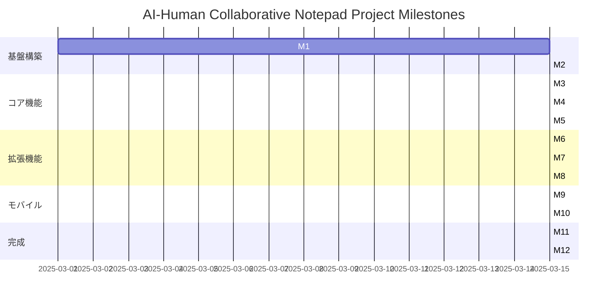

# 開発マイルストーン

このドキュメントでは、AI-Human Collaborative Notepad Projectの開発マイルストーンを詳細に定義します。各マイルストーンは、プロジェクトの進捗を測定し、開発チームが焦点を合わせるべき具体的な目標を提供します。

## マイルストーン概要



## マイルストーン詳細

### M1: プロジェクト初期化

**目標**: プロジェクトの基本構造を確立し、開発環境を整備する

**成果物**:
- Electronプロジェクトの初期設定
- TypeScriptの設定と基本構造
- 開発・ビルドパイプラインの構築
- 基本的なアプリケーションシェル

**評価基準**:
- アプリケーションが起動し、基本的なウィンドウが表示される
- TypeScriptのコンパイルとリンティングが機能する
- 開発環境でのホットリロードが機能する
- CIパイプラインが設定され、基本的なテストが実行される

**リスクと対策**:
- 依存関係の互換性問題 → 明確なバージョン固定と依存関係の最小化
- 開発環境の差異 → Docker開発環境の提供

### M2: 基本アーキテクチャ実装

**目標**: アプリケーションの基本アーキテクチャを実装し、主要コンポーネント間の連携を確立する

**成果物**:
- SQLiteデータベースの統合
- 基本的なファイル操作機能
- アプリケーションの状態管理（Zustand）
- コンポーネント間の通信システム
- 基本的なUIフレームワークの統合

**評価基準**:
- データの永続化と取得が機能する
- アプリケーション状態が適切に管理される
- コンポーネント間でデータと操作が共有される
- 基本的なUIコンポーネントが表示される

**リスクと対策**:
- アーキテクチャの複雑化 → モジュール境界の明確な定義
- パフォーマンスのボトルネック → 早期のパフォーマンステスト

### M3: エディタ基本機能

**目標**: アプリケーションの中核となるリッチテキストエディタを実装する

**成果物**:
- TipTapエディタの統合
- 基本的なテキスト編集機能
- Markdownパーサーとレンダラー
- コードブロック、表、リストなどの拡張機能
- 自動保存機能

**評価基準**:
- リッチテキスト編集が滑らかに機能する
- Markdownの入出力が正確に行われる
- 特殊なブロック（コード、表など）が適切に表示・編集できる
- 編集内容が自動的に保存される

**リスクと対策**:
- 複雑なエディタ操作のパフォーマンス → 最適化とテスト
- Markdownとリッチテキストの変換精度 → 変換エッジケースのテスト

### M4: ノート管理システム

**目標**: ノートの作成、編集、整理のための基本システムを実装する

**成果物**:
- ノートの作成、編集、削除機能
- タグとプロパティシステム
- ノート間のリンク機能
- ノートのインポート/エクスポート機能
- ノートリストとナビゲーション

**評価基準**:
- ノートのCRUD操作が正常に機能する
- タグとプロパティによる整理が可能
- ノート間のリンクが機能する
- 外部形式とのインポート/エクスポートが可能
- ノート間のナビゲーションがスムーズ

**リスクと対策**:
- 大量のノートでのパフォーマンス → 仮想化リストと遅延ロード
- 複雑なデータ構造の管理 → 明確なデータモデルと型定義

### M5: 検索と整理機能

**目標**: 情報の検索と整理のための高度な機能を実装する

**成果物**:
- 全文検索エンジン（MiniSearch）の実装
- タグとプロパティによるフィルタリング
- 検索結果の表示と整理
- 関連ノートの推奨機能
- データベースビュー（表形式、カンバン、ギャラリー）

**評価基準**:
- 検索が高速かつ正確に機能する
- 複雑なフィルタリングが可能
- 検索結果が適切に表示される
- 様々なビュー形式でデータが表示される

**リスクと対策**:
- 検索パフォーマンス → インデックス最適化とキャッシング
- 複雑なビューのレンダリング → 仮想化と遅延ロード

### M6: タスク管理機能

**目標**: ナレッジベースと統合されたタスク管理機能を実装する

**成果物**:
- タスクの作成、編集、完了機能
- 優先度と期限の設定
- タスクのタグ付けとカテゴリ分け
- タスクの視覚化（リスト、カンバン、カレンダー）
- リマインダーと通知

**評価基準**:
- タスク管理の基本操作が機能する
- 様々な視点でタスクを整理・表示できる
- リマインダーが適切なタイミングで通知される
- ノートとタスクが統合されている

**リスクと対策**:
- 通知システムの複雑さ → プラットフォーム固有の実装の分離
- カレンダー表示の複雑さ → 既存ライブラリの活用

### M7: プラグインシステム

**目標**: アプリケーションの拡張性を高めるプラグインシステムを実装する

**成果物**:
- プラグインAPIの設計と実装
- プラグインのライフサイクル管理
- サンドボックス環境の構築
- プラグインの設定と管理UI
- コアプラグインの開発（テーマ、エクスポート、外部サービス連携）

**評価基準**:
- プラグインが安全に読み込まれ実行される
- プラグインがアプリケーションの機能を拡張できる
- プラグインの設定が保存・読み込みされる
- コアプラグインが正常に機能する

**リスクと対策**:
- セキュリティリスク → サンドボックス化と権限モデル
- APIの安定性 → 明確なバージョニングと互換性ポリシー

### M8: 同期・コラボレーション機能

**目標**: 複数デバイス間の同期とコラボレーション機能を実装する

**成果物**:
- サーバーコンポーネントの開発
- Y.jsを使用した差分同期
- オフライン編集と競合解決
- リアルタイム共同編集
- ユーザー認証と権限管理

**評価基準**:
- デバイス間でデータが正確に同期される
- オフライン編集が可能で、オンライン復帰時に同期される
- 複数ユーザーによる同時編集が可能
- 競合が適切に解決される

**リスクと対策**:
- 複雑な同期ロジック → 徹底的なテストとエッジケース対応
- ネットワーク問題 → 堅牢なエラーハンドリングと再試行メカニズム

### M9: モバイルアプリ基盤

**目標**: モバイルプラットフォーム向けのアプリケーション基盤を構築する

**成果物**:
- React Nativeプロジェクトの設定
- TypeScript設定
- コアロジックの共有戦略の実装
- 基本的なアプリシェルの構築
- ネイティブモジュールの統合

**評価基準**:
- モバイルアプリが起動し、基本的なUIが表示される
- デスクトップ版とコードが共有されている
- ネイティブ機能（ストレージなど）が統合されている

**リスクと対策**:
- プラットフォーム間の差異 → 抽象化レイヤーの導入
- コード共有の複雑さ → モノレポ構造と明確な境界

### M10: モバイル機能実装

**目標**: モバイル向けの機能とUIを実装する

**成果物**:
- モバイル向けエディタの最適化
- タッチインターフェースの実装
- モバイル固有機能（カメラ統合など）
- オフラインモードの実装
- 同期機能の統合

**評価基準**:
- モバイルでの編集体験が最適化されている
- タッチ操作が直感的に機能する
- モバイル固有機能が統合されている
- オフラインでも機能し、オンライン時に同期される

**リスクと対策**:
- モバイルパフォーマンス → 最適化とプロファイリング
- デバイス固有の問題 → 広範なデバイステスト

### M11: テストと最適化

**目標**: アプリケーションの品質と性能を確保する

**成果物**:
- 単体テストの実装
- 統合テストの実装
- エンドツーエンドテストの実装
- パフォーマンス最適化
- メモリ使用量の最適化
- バッテリー消費の最適化

**評価基準**:
- テストカバレッジが目標値を達成している
- パフォーマンス指標が目標値を達成している
- 大規模データセットでも安定して動作する
- バッテリー消費が最適化されている

**リスクと対策**:
- テスト環境の複雑さ → CI/CDパイプラインの強化
- パフォーマンスの測定と分析 → 自動化されたベンチマーク

### M12: リリース準備

**目標**: アプリケーションのリリースに向けた最終準備を行う

**成果物**:
- インストーラーの作成
- 自動更新システムの実装
- ドキュメントとヘルプの完成
- マーケティング資料の準備
- バグ修正と最終調整

**評価基準**:
- インストールと更新プロセスがスムーズに機能する
- ドキュメントが完成し、ユーザーが理解できる
- 既知の重大なバグが修正されている
- 全プラットフォームでの動作が確認されている

**リスクと対策**:
- 配布プラットフォームの要件 → 各プラットフォームのガイドラインの確認
- 最終バグの発見 → ベータテストプログラムの実施

## 進捗追跡と報告

各マイルストーンの進捗は以下の方法で追跡・報告します：

1. **進捗状況**: 未着手 / 進行中 / 完了
2. **完了率**: 0-100%の数値で表現
3. **主要タスク**: 各マイルストーン内の主要タスクとその状態
4. **ブロッカー**: 進行を妨げている問題や依存関係
5. **次のステップ**: 次に取り組むべきタスク

進捗報告は週次で更新し、以下の形式で記録します：

```
## 週次進捗報告: YYYY-MM-DD

### マイルストーン状況
- M1: 完了 (100%)
- M2: 進行中 (75%)
  - 完了: データベース統合, 状態管理
  - 進行中: ファイル操作機能
  - 未着手: UIフレームワーク統合
- M3: 未着手 (0%)

### ブロッカー
- SQLiteのWebAssembly版との互換性問題

### 次週の目標
- M2の完了
- M3の着手
```

## 優先順位の調整

マイルストーンの優先順位は以下の要素に基づいて定期的に見直します：

1. **依存関係**: 技術的な依存関係に基づく順序
2. **ユーザー価値**: ユーザーにとっての価値の大きさ
3. **リスク軽減**: 早期に対処すべき技術的リスク
4. **フィードバック**: 開発過程で得られたフィードバック

優先順位の変更は、チーム全体で合意した上で行い、変更の理由と影響を文書化します。

## 成功指標

各マイルストーンの成功を測るための主要指標：

1. **機能完成度**: 計画された機能の実装率
2. **品質指標**: テストカバレッジ、バグ数、静的解析結果
3. **パフォーマンス指標**: 応答時間、メモリ使用量、起動時間
4. **ユーザー指標**: ユーザーテストでの満足度、タスク完了率

これらの指標は、各マイルストーンの完了時に測定し、目標値との比較を行います。

## 結論

このマイルストーン計画は、AI-Human Collaborative Notepad Projectの開発を体系的に進めるための指針です。各マイルストーンは明確な目標と評価基準を持ち、プロジェクト全体の進捗を可視化します。

開発の過程で新たな知見や要件が発生した場合は、このマイルストーン計画も柔軟に調整していきます。重要なのは、ユーザーにとって価値のある機能を段階的に実装し、品質を確保しながら開発を進めることです。

AI-Human協働開発モデルを最大限に活用し、効率的かつ創造的な開発プロセスを実現していきましょう。
