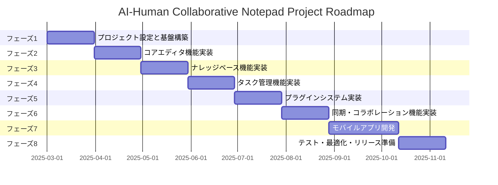
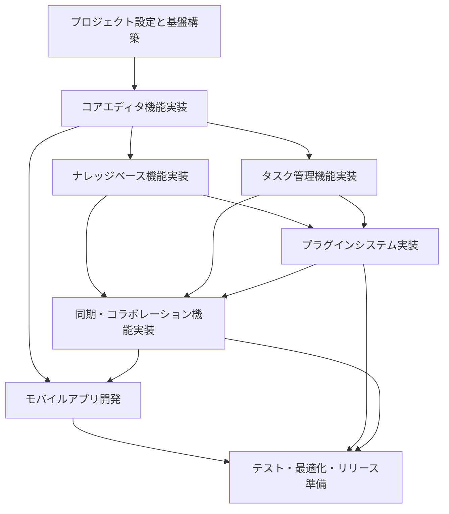

# 開発ロードマップ

このドキュメントでは、AI-Human Collaborative Notepad Projectの開発ロードマップとマイルストーンを定義します。このロードマップは、プロジェクトの進行状況を追跡し、開発の優先順位を決定するための指針となります。

## 開発フェーズ

プロジェクトは以下の主要フェーズに分けて開発を進めます。各フェーズには明確なマイルストーンと目標を設定し、段階的に機能を実装していきます。

## フェーズ1: プロジェクト設定と基盤構築

**目標**: プロジェクトの基本構造を確立し、開発環境を整備する

### マイルストーン 1.1: プロジェクト初期化
- Electronプロジェクトのセットアップ
- TypeScriptの設定
- ビルドパイプラインの構築
- 基本的なアプリケーションシェルの実装

### マイルストーン 1.2: 基本アーキテクチャの実装
- SQLiteデータベースの統合
- 基本的なファイル操作機能の実装
- アプリケーションの状態管理（Zustand）の設定
- 基本的なUIフレームワークの統合

### マイルストーン 1.3: 開発環境の整備
- テスト環境の構築
- CI/CDパイプラインの設定
- コード品質ツールの導入
- ドキュメント生成システムの構築

## フェーズ2: コアエディタ機能実装

**目標**: アプリケーションの中核となるエディタ機能を実装する

### マイルストーン 2.1: リッチテキストエディタの実装
- TipTapエディタの統合
- 基本的なテキスト編集機能の実装
- Markdownパーサーとレンダラーの実装
- コードブロック、表、リストなどの拡張機能

### マイルストーン 2.2: エディタUI/UXの強化
- ツールバーとフォーマットオプションの実装
- ショートカットキーの実装
- ドラッグ＆ドロップ機能
- 画像挿入と管理

### マイルストーン 2.3: 自動保存と履歴管理
- リアルタイム自動保存機能
- 変更履歴の追跡と管理
- バージョン比較機能
- 編集位置の記憶と復元

## フェーズ3: ナレッジベース機能実装

**目標**: 情報の整理と検索のためのナレッジベース機能を実装する

### マイルストーン 3.1: ノート管理システム
- ノートの作成、編集、削除機能
- タグとプロパティシステムの実装
- ノート間のリンク機能
- ノートのインポート/エクスポート機能

### マイルストーン 3.2: 検索と発見機能
- 全文検索エンジン（MiniSearch）の実装
- タグとプロパティによるフィルタリング
- 検索結果の表示と整理
- 関連ノートの推奨機能

### マイルストーン 3.3: 知識の視覚化
- ノート間の関係を表示するグラフビュー
- アウトライン表示機能
- データベースビュー（表形式、カンバン、ギャラリー）
- ダッシュボードとウィジェット

## フェーズ4: タスク管理機能実装

**目標**: ナレッジベースと統合されたタスク管理機能を実装する

### マイルストーン 4.1: タスクの基本機能
- タスクの作成、編集、完了機能
- 優先度と期限の設定
- タスクのタグ付けとカテゴリ分け
- 繰り返しタスクの設定

### マイルストーン 4.2: タスクの視覚化
- リスト表示
- カンバンボード表示
- カレンダー表示
- ガントチャート表示

### マイルストーン 4.3: タスク管理の高度な機能
- サブタスクとタスクの階層化
- 進捗追跡と統計
- リマインダーと通知
- タスクとノートの統合

## フェーズ5: プラグインシステム実装

**目標**: アプリケーションの拡張性を高めるプラグインシステムを実装する

### マイルストーン 5.1: プラグインアーキテクチャの設計
- プラグインAPIの設計と実装
- プラグインのライフサイクル管理
- サンドボックス環境の構築
- プラグインの設定と管理UI

### マイルストーン 5.2: コアプラグインの開発
- テーマシステムプラグイン
- エクスポート/インポートプラグイン
- 外部サービス連携プラグイン
- 高度な検索プラグイン

### マイルストーン 5.3: プラグイン開発キットの提供
- プラグイン開発ドキュメント
- プラグインテンプレートとサンプル
- プラグインデバッグツール
- プラグイン配布システム

## フェーズ6: 同期・コラボレーション機能実装

**目標**: 複数デバイス間の同期とコラボレーション機能を実装する

### マイルストーン 6.1: サーバーコンポーネントの開発
- Node.js/Expressサーバーの実装
- ユーザー認証システム
- データストレージとバックアップ
- APIエンドポイントの設計と実装

### マイルストーン 6.2: 同期機能の実装
- Y.jsを使用した差分同期
- オフライン編集と競合解決
- 同期設定と管理UI
- 同期状態の視覚化

### マイルストーン 6.3: コラボレーション機能の実装
- リアルタイム共同編集
- コメントと提案機能
- ユーザープレゼンス表示
- 権限管理と共有設定

## フェーズ7: モバイルアプリ開発

**目標**: デスクトップアプリと同期するモバイルアプリを開発する

### マイルストーン 7.1: React Nativeプロジェクトの設定
- React Nativeプロジェクトの初期化
- TypeScript設定
- コアロジックの共有戦略の実装
- 基本的なアプリシェルの構築

### マイルストーン 7.2: モバイル向けUI/UXの実装
- モバイル向けエディタの最適化
- タッチインターフェースの実装
- レスポンシブデザインの適用
- オフラインモードの実装

### マイルストーン 7.3: プラットフォーム固有機能の統合
- カメラとギャラリーの統合
- 通知システムの実装
- ウィジェットの開発
- バイオメトリック認証の統合

## フェーズ8: テスト・最適化・リリース準備

**目標**: アプリケーションの品質を確保し、リリースの準備を整える

### マイルストーン 8.1: 包括的テスト
- 単体テストの実装
- 統合テストの実装
- エンドツーエンドテストの実装
- パフォーマンステストの実施

### マイルストーン 8.2: パフォーマンス最適化
- メモリ使用量の最適化
- 起動時間の短縮
- レンダリングパフォーマンスの向上
- バッテリー消費の最適化

### マイルストーン 8.3: リリース準備
- インストーラーの作成
- 自動更新システムの実装
- ドキュメントとヘルプの完成
- マーケティング資料の準備

## 優先順位と依存関係

開発の優先順位は以下の原則に基づいて決定します：

1. **コア機能優先**: ユーザーが日常的に使用する基本機能を最初に実装
2. **段階的複雑性**: 単純な機能から複雑な機能へと段階的に開発を進める
3. **依存関係の考慮**: 技術的な依存関係に基づいて実装順序を決定
4. **ユーザーフィードバックの反映**: 早期のフィードバックを取り入れて優先順位を調整

## リスク管理

開発過程で予想されるリスクとその対策を以下に示します：

### 技術的リスク

1. **Electronのパフォーマンス問題**
   - 対策: 効率的なコード実装、仮想化リスト、レンダリング最適化

2. **大規模データセットでの検索パフォーマンス**
   - 対策: インデックス最適化、検索アルゴリズムの改良、ページネーション

3. **同期の競合解決の複雑さ**
   - 対策: 徹底的なテスト、エッジケースの特定と対応、ユーザーフレンドリーな競合解決UI

### スケジュールリスク

1. **機能スコープの拡大**
   - 対策: 明確な優先順位付け、MVPの定義、段階的リリース計画

2. **技術的負債の蓄積**
   - 対策: 定期的なリファクタリング、コードレビュー、技術的負債の可視化

3. **予期せぬ技術的課題**
   - 対策: バッファ期間の設定、リスクの早期特定、代替アプローチの準備

## 成功指標

プロジェクトの成功を測るための主要指標：

1. **機能完成度**: 計画された機能の実装率
2. **パフォーマンス指標**: 起動時間、メモリ使用量、操作の応答時間
3. **コード品質**: テストカバレッジ、静的解析結果、バグ率
4. **ユーザー満足度**: ベータテスターからのフィードバック、使用継続率
5. **開発効率**: 反復サイクル時間、AI-Human協働の効率性

## 継続的改善

このロードマップは固定されたものではなく、以下のタイミングで定期的に見直しと更新を行います：

1. 各フェーズの完了時
2. 重要なマイルストーン達成時
3. 技術環境の大きな変化があった場合
4. ユーザーフィードバックに基づく優先順位の変更時

## 結論

このロードマップは、AI-Human Collaborative Notepad Projectの開発の道筋を示すものです。TypeScriptを中心とした技術スタックを活用し、段階的に機能を実装していくことで、ユーザーにとって価値のある、高品質なアプリケーションを開発することを目指します。AI-Human協働開発モデルを最大限に活用し、効率的かつ創造的な開発プロセスを実現します。
